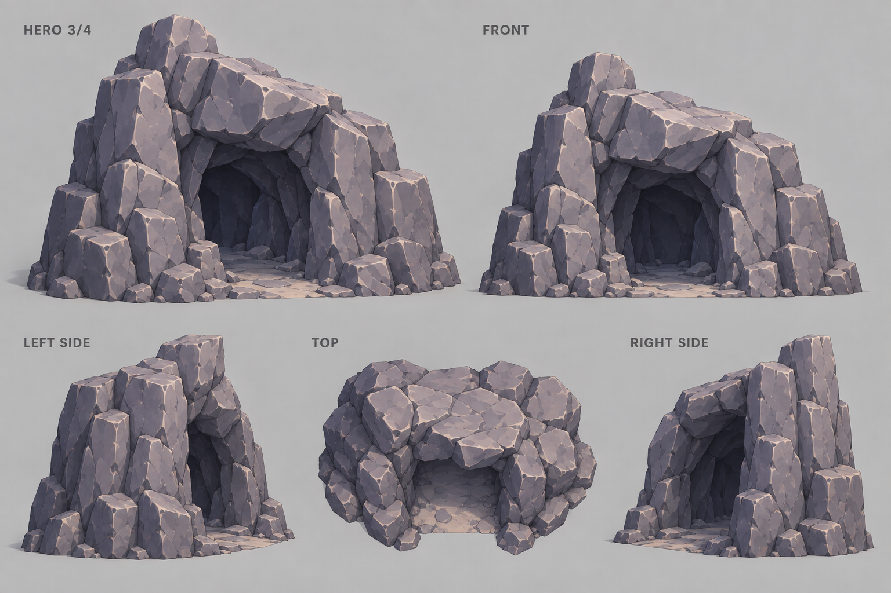

# Natural cave entrance · 3D modeling reference v1

An isolated natural-rock cave-mouth asset in the project's faceted slate/violet stone style. The sheet includes a hero view plus front, left, right and top views to communicate the opening silhouette, massing, and depth. It is a visual concept for modeling, not a calibrated orthographic render or finished game asset; confirm the gameplay clearance and collision shape against the player when building the mesh.

**Superseded:** this first concept depicts a deep cave recess. The requested asset is only a shallow entrance facade with an opening through the back; use [cave-entrance-model-v2-open-through.png](cave-entrance-model-v2-open-through.png) instead.

## Prompt

> Create a professional 3D asset modeling reference sheet for one standalone stylized pirate-game cave entrance model. This is a 3D model asset on a plain neutral grey studio background, not an environment scene or painted illustration. Match the project's cave/rock reference: broad readable faceted slate-grey and muted violet stone masses, hand-shaped stylized low-poly planes, crisp cel-shading, restrained surface detail. Model a natural irregular cave mouth cut into a thick freestanding rocky cliff chunk: tall asymmetrical arch-shaped opening with broken angular rock shoulders and a heavy faceted lintel, readable dark recessed tunnel depth, a few broad shadow facets inside, flat walkable stone/sand threshold continuous through the opening. Strong clear silhouette, substantial model thickness, stable broad base. The opening should be human/player-sized, roughly two times taller than a game character is wide; no character in the sheet. No timber supports, masonry blocks, buildings, doors, crystals, plants or props. Show consistent views on clean light grey: hero 3/4, front orthographic, left side orthographic, right side orthographic, top-down footprint. Keep proportions and rock silhouette consistent across panels; side views clearly reveal cliff chunk depth and tunnel recess, front shows the cave opening unobstructed, top view shows the cave mouth and mass depth. Full model visible in every panel, no cropping. Labels: HERO 3/4, FRONT, LEFT SIDE, RIGHT SIDE, TOP. Soft studio lighting to reveal facets and opening depth; no dramatic scene lights. Keep model structurally practical for gameplay with natural asymmetry in rock edges. Avoid noisy tiny cracks, photorealism, outlines, extra text, logo or watermark.
