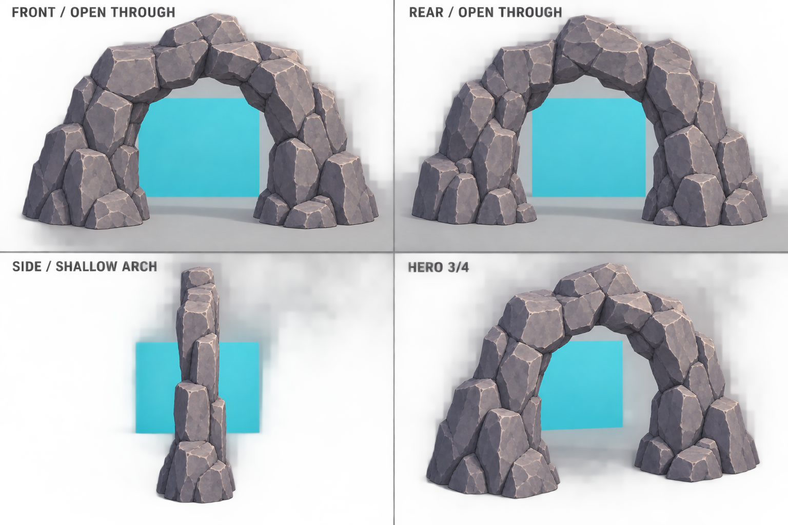

# Natural cave entrance facade · modeling reference v2

This is only the front entrance piece: a shallow natural-rock arch with an opening through its full thickness. The bright turquoise studio card behind the model is deliberately visible through the hole to make the open rear unambiguous; it is not part of the asset. The separately built tunnel connects behind this piece. The image is a modeling concept, not calibrated orthographic output.

## Prompt

> Single isolated 3D model reference sheet of a shallow natural stone cave entrance portal only. It is a rock arch/ring, not a cave, not a tunnel, not a cliff with a dark recess. The central opening is a literal empty hole through the whole ring; in both front and rear views the pale grey studio background must be clearly visible through the aperture. The rock is only a shallow freestanding arch-shaped formation, 0.4 m deep front-to-back compared with a 3 m-wide opening, like a thick natural stone ring. The tunnel is built separately and must not appear anywhere in this model. No long interior, no dark cavity, no back wall, no interior floor extending backward, no rock mass closing the far side. Use a restrained stylized pirate-game faceted stone style: broad readable slate-grey/violet boulder facets, cel shaded, natural uneven boulders, restrained detail. Create a modeling reference sheet with four views of the exact same shallow entrance piece: front orthographic, rear orthographic, side orthographic, and hero 3/4 view. In front and rear show a bright turquoise-blue flat studio backdrop card several meters behind the model, visible through the hole; the card is a reference backdrop, not part of the asset. Side view shows shallow arch thickness, not a corridor. Hero view clearly sees through the hole. Preserve same dimensions and shape in all views, full arch visible. Labels: FRONT / OPEN THROUGH, REAR / OPEN THROUGH, SIDE / SHALLOW ARCH, HERO 3/4. No tunnel walls, no dark recess, no sealed surface, no environment or props. Professional isolated 3D asset visual, no extra text, logo or watermark.
