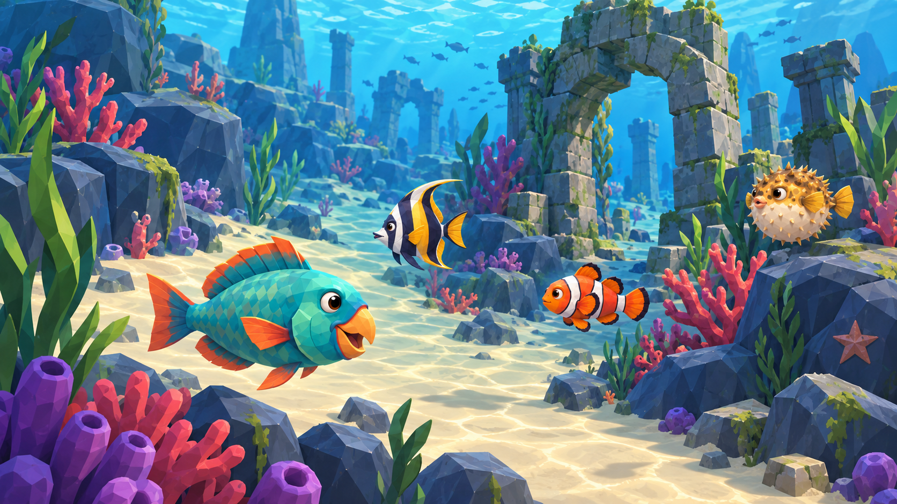
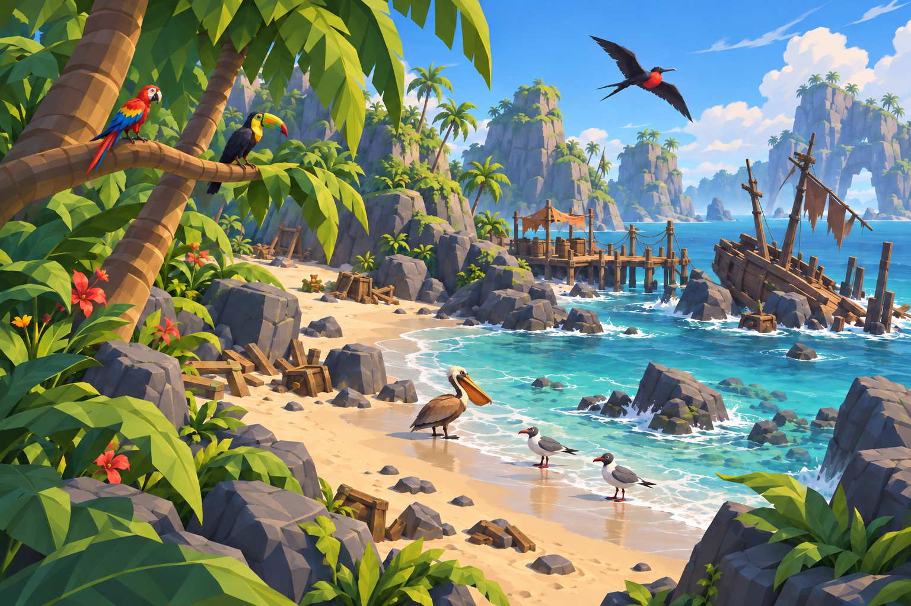

# Animals in pirate-world environments · v1

Two scene-matching studies use the project's underwater ruin and tropical beach environment references. They are generated concept compositions, not in-engine screenshots or finished 3D models.

## Shallow reef

Parrotfish, angelfish, clownfish and pufferfish inhabit shallow turquoise water among faceted rocks, coral, seagrass, sand and submerged ruins.

Prompt: Compose a bright shallow reef and ruined stone arch using the game's underwater reference. Integrate a readable parrotfish in the foreground, angelfish and clownfish near coral, and pufferfish beside a rock. Use the marine-animal sheet for species identity, and the captain sheet only for broad stylized facets and toon finish. Match the game palette and simplify fish surface detail to broad clean facets. No people or interface.

## Tropical cove

Macaw and toucan perch in palm foliage; pelican and gulls occupy the wet sand; a frigatebird flies above the cove. The birds were reduced in size after the first composition so they sit more naturally in the environment.

Prompt: Compose a tropical cove from the pirate beach/shipwreck environment reference: dry sand, wet shore, turquoise water, faceted rocks, palms, pier and wreck. Include a macaw and toucan in palm foliage, a pelican at the waterline, two gulls on sand and a frigatebird above. Keep the bird reference species traits, reduce their rendering to broad stylized facets consistent with the game, and use plausible world scale. No people or interface.

## Review note

Both scenes use broad colorful shapes and the pirate game's cel-shaded direction. The reef fish remain oversized in the close foreground by design; judge their surface style separately from world scale. Neither scene was rendered by Godot; lighting, collision, animation and in-game scale still require a scene implementation.
