# Funny animal style revision · v2

This pass pushes the fish and coastal birds toward the expressive, funny character language of the captain and grunt: exaggerated anatomy, broad readable shapes and faceted toon materials, while preserving recognizable species silhouettes. It adds revised model-reference sheets and new environment studies. These are image-generation concepts, not Godot renders, finished models, or topology/rig specifications. The earlier v1 references remain available for comparison.

## Marine animals

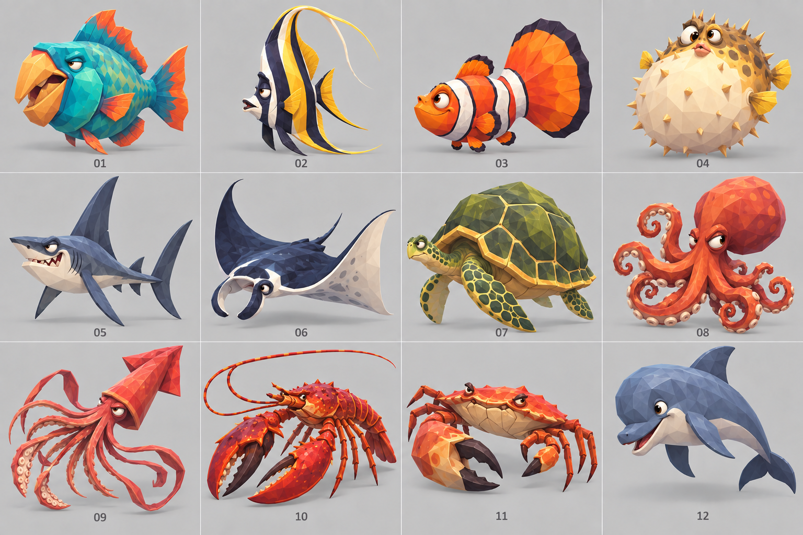

For feedback by species, use this companion sheet with numbers and readable labels:

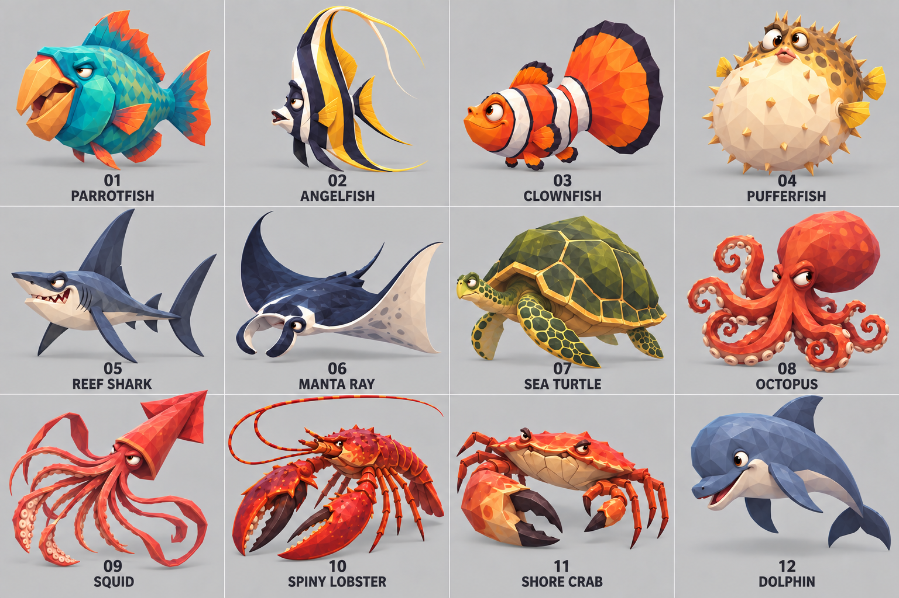

**Labeling prompt:**

> Make a revised, clearly labeled model-reference sheet of the 12 tropical marine animals from the attached fish sheet. Keep exactly the same species, one animal per cell, in the same 4-column x 3-row grid and same left-to-right, top-to-bottom order. Match the attached bird sheet's clear typography treatment: each cell must have a large distinct two-digit number (01–12) and an easy-to-read short species name directly below the animal, aligned in the same position. Species in order: 01 PARROTFISH, 02 ANGELFISH, 03 CLOWNFISH, 04 PUFFERFISH, 05 REEF SHARK, 06 MANTA RAY, 07 SEA TURTLE, 08 OCTOPUS, 09 SQUID, 10 SPINY LOBSTER, 11 SHORE CRAB, 12 DOLPHIN. Preserve the current funny stylized designs and their identities; do not redesign or replace species. Keep them as clean, readable, broad-faceted cel-shaded pirate game creatures with the same playful exaggerated proportions, consistent lighting, clean light neutral-grey cell backgrounds and clear gutters. Fit the number and species label fully inside each cell. Spell each label exactly as listed, uppercase, dark high-contrast simple sans serif, large enough to read. No other words, no title, no logos, no watermark. Maintain uncluttered layout and never crop the animals or labels.

Uses the v1 marine species order: parrotfish, angelfish, clownfish, pufferfish, reef shark, manta ray, sea turtle, octopus, squid, spiny lobster, shore crab, bottlenose dolphin.

**Prompt:**

> Use case stylized-concept. Create a new revision of the 12-animal tropical marine modeling sheet in the same strict 4x3 grid with numbers 01-12 and clean neutral grey panels. Input image1 is the current species sheet for exact species order; image2 captain/grunt is the personality and silhouette style source; image3 corals is the faceted shape language. Redesign each animal with much more whimsical, hilarious, exaggerated proportions, like the funny human characters: 01 parrotfish with massive protruding beak lips and tiny squinty eye, chunky head; 02 angelfish tall absurdly narrow disk, flappy fins; 03 clownfish plump with comically huge tail and tiny fins; 04 pufferfish lopsided inflated belly, tiny fins, quizzical eyes, blunt sparse spikes; 05 reef shark long skinny body and overlong dorsal fin, big underbite; 06 manta ray huge droopy diamond wings and tiny little face; 07 sea turtle tiny head, huge heavy patterned shell and paddle flippers; 08 octopus bulbous head and eight expressive mismatched curling arms; 09 squid giant cone mantle and absurd long ribbon tentacles; 10 spiny lobster oversized asymmetrical claws and whiskery antennae; 11 shore crab extremely wide shell with skinny awkward legs and uneven claws; 12 bottlenose dolphin big round forehead and short curled snout, chunky torso. Keep proper species anatomy and unmistakable species silhouettes, never turn them into people or mice. Pose each with funny gestural personality and off-balance asymmetry, but only correct animal parts. Faceted low poly planes and broad saturated natural color fields, cel-shading, restrained surface detail, no realistic tiny scales. Match bold readable color grouping and charm of the pirate captain/grunt. Isolated three-quarter view, same camera and light for all, each fills its own panel without cropping, soft contact shadow only. Light neutral grey background, small clear number under each, no other text or props. Avoid sleek generic fish, ordinary realistic anatomy, giant photorealistic eyes, duplication, added limbs or fins, overlapping panels.

## Coastal birds

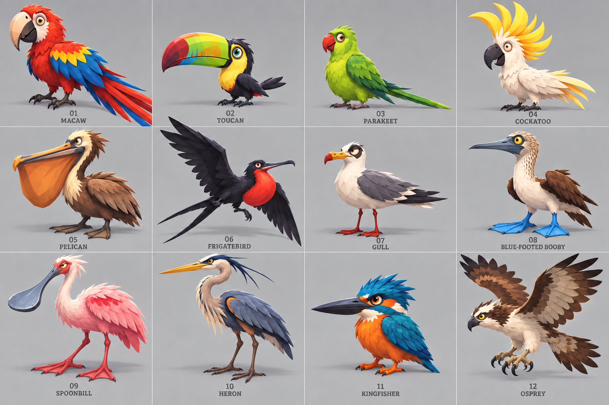

The twelve species follow v1 order: macaw, toucan, parakeet, cockatoo, pelican, frigatebird, gull, blue-footed booby, spoonbill, heron, kingfisher and osprey.

**Prompt:**

> Create a polished 3D game art concept sheet for a stylized pirate game's coastal birds, revision with much funnier, more distinctive silhouettes. Follow the attached 12-bird sheet for the exact numbered 4-by-3 grid and species order and the captain/grunt comparison for style: clean, readable broad faceted toon shapes, saturated restrained tropical colors, full-body birds in consistent profile/three-quarter view, even spacing, simple studio background, numbers 01–12 and short species labels. Species: macaw, toucan, parakeet, cockatoo; pelican, frigatebird, gull, blue-footed booby; spoonbill, heron, kingfisher, osprey. Exaggerate real anatomy comically but keep each clearly identifiable: huge macaw head and tail on compact body; absurd toucan beak tiny body; pear-shaped parakeet and long tail; giant swept cockatoo crest; oversized pelican pouch; frigatebird theatrical long fork-tail and broad wings; stout gull with thin legs and side-eye; oversized booby feet; very wide spoonbill; bendy S-neck heron; bulbous kingfisher head and big beak; broad angular osprey wings and tousled crest. Whimsical, gestural, appealing character forms, not realistic wildlife; correct bird anatomy, no human features, mouse-like snouts, clothes, or props. Distinct silhouettes, crisp professional model-reference sheet, no text other than labels/numbers.

## Reef scene

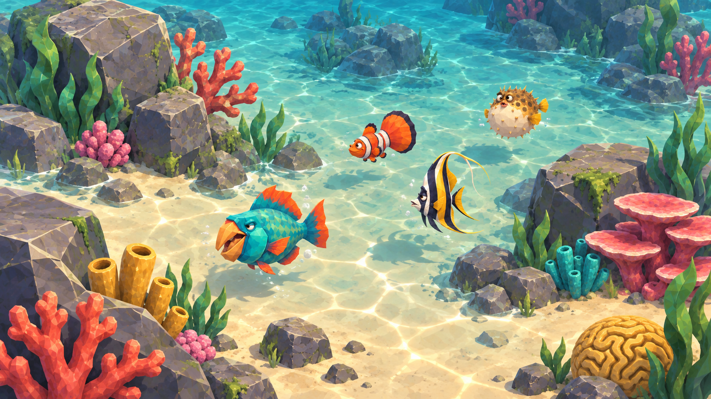

The revised reef study puts comic but species-readable fish among faceted rock, coral and shallow seabed, with the environment leading the composition.

**Prompt:**

> Create a wide 16:9 finished in-game environment concept for the stylized pirate game shown in the attached references, a shallow tropical reef where funny characterful fish swim among faceted rocks and chunky stylized corals. Match the exact clean cel-shaded broad-faceted art style and scale language of the captain/grunt game characters, the beach/shore terrain reference, and the attached revised funny marine-animal species sheet. Camera is a slightly elevated third-person game camera, broad readable composition, clear turquoise shallow water with pale sand visible beneath, soft sunlit bands and restrained stylized surface caustic marks, no dense noisy patterns. Put several distinct, fairly small fish in the scene: one medium foreground parrotfish with an exaggerated funny beak/lips and compact body, a disc-shaped angelfish, a plump clownfish, and a small pufffish; they should read as lively creature characters but remain plausible game-world scale beside coral and rocks, not giant. Include just a few faceted rocks and branching rounded coral forms in restrained warm coral accents, teal and green plants. Integrate natural underwater light and grounding, clear silhouettes, no humans, no UI, no text, no outlines around every object, no photorealism.

## Cove scene

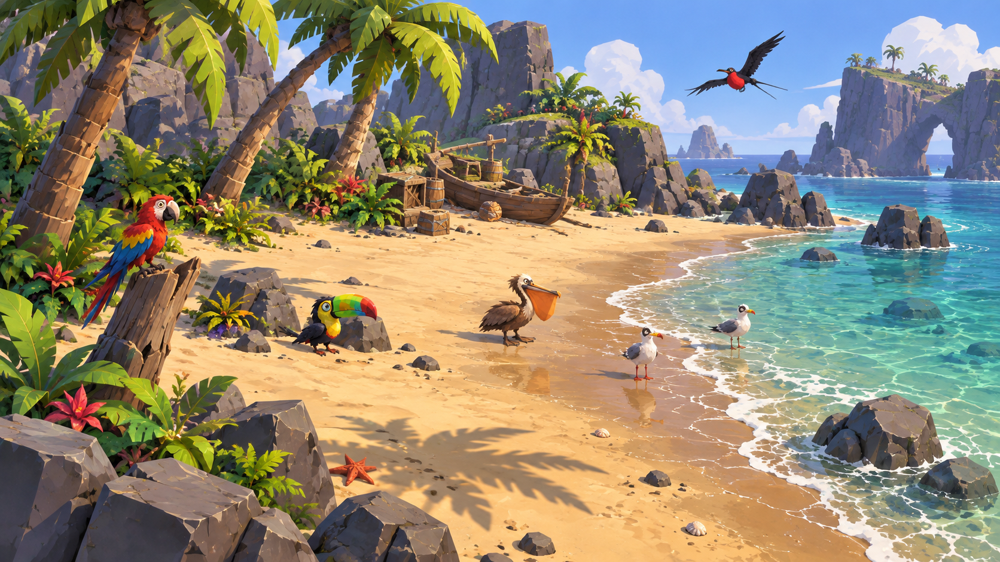

The bird study uses a cove with warm dry and wet sand, turquoise shallows, palms, plants and rocks. The birds have stronger proportions but stay small enough for the landscape to remain the focus.

**Prompt:**

> Create a wide 16:9 in-game cove environment concept for the same stylized pirate game as the attached reference images. Match the captain/grunt character's clean faceted cel-shaded look, the warm beach/wet-sand/shallow-water shore reference, and the attached revised funny coastal bird sheet. A calm tropical cove viewed from a slightly elevated third-person game camera: broad readable pale golden beach, warm brown wet-sand band along a gently curving waterline, clear turquoise shallows, a few pale irregular foam flecks at shore, faceted gray coastal rocks, two curved palms and grouped low tropical plants. Place a small cast of funny but correctly recognizable birds naturally in the scene: one compact macaw perched low on a driftwood stump, a small toucan standing near a rock with oversized beak, a pelican on the wet sand, two tiny gulls near the water, and one frigatebird small in the sky. Their exaggerated anatomy should echo character design—big expressive heads, beaks, pouches, or feet—but remain clearly birds and appropriate world scale, not giant mascots. Overall environment is the hero; animals occupy modest portions of frame. Broad color blocks, strong stylized cast shadows, faceted shapes, clear gameplay-distance silhouettes, restrained surface detail, polished production concept. No people, no UI, no typography, no outlining everything, no photorealism.

## Art direction assessment

This revision is closer to the game's character direction: amusing proportions and stronger expressions come from each animal's anatomy (beak, pouch, shell, tail, crest or feet), not human faces or costume. The fish scene intentionally contains only four fish so silhouettes stay readable; the image generator does not perfectly enforce exact species, so use the separate numbered sheet for species selection. The scenes are art-direction previews only; in-game scale, shader behavior, lighting and animation still need to be checked in Godot.

## Selected marine animal redesigns · v3

The next focused sheet revises only the species requested for another pass: 03 clownfish, 06 manta ray, 07 sea turtle, 08 octopus, 10 spiny lobster and 12 bottlenose dolphin. It is a proposal sheet for reviewing those designs before incorporating them into the full twelve-animal sheet.

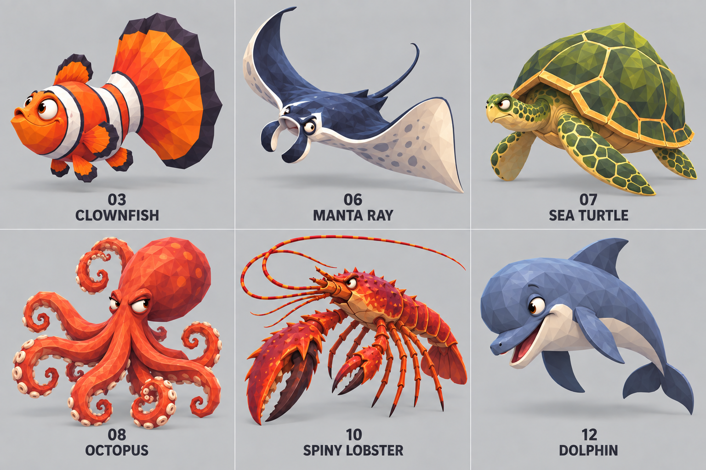

## Updated selected marine animal redesigns · v4

The selection was revised to 03 clownfish, 06 manta ray, 08 octopus, 09 squid, 10 spiny lobster and 12 dolphin. This sheet includes only those six alternatives, labeled in that order; v3 remains as a comparison.

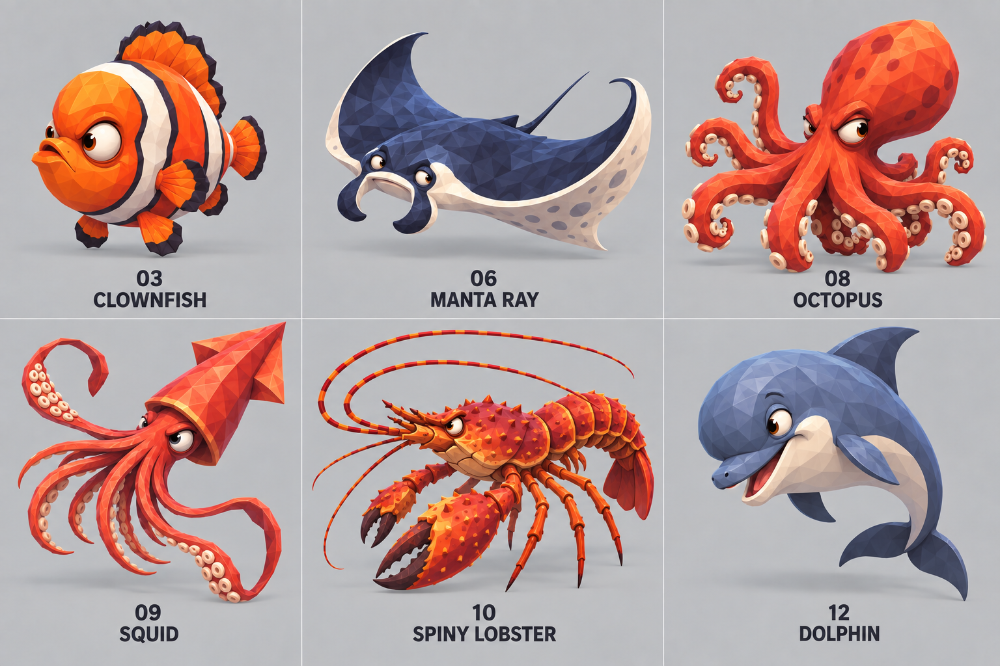

## Less-cute redesigns · 08, 09, 12

The octopus, squid and dolphin have a further pass emphasizing angular, awkward comic personalities over cute, plush proportions.

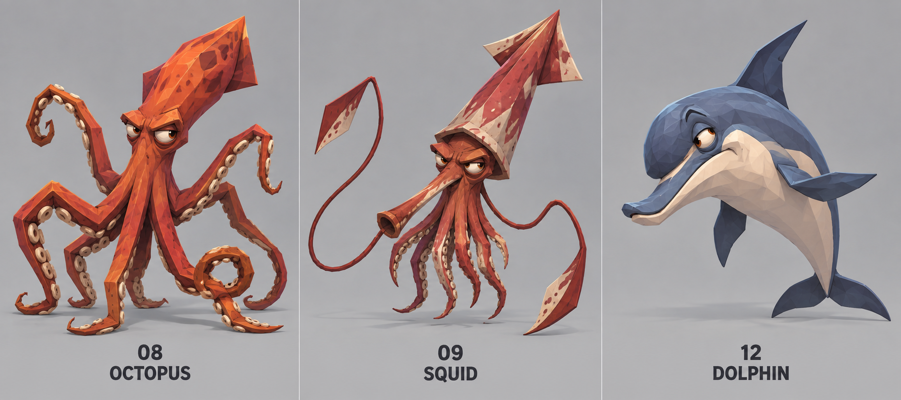

## Less-cute iteration · v6

Further variation on the same three designs, continuing the angular, awkward comic direction.

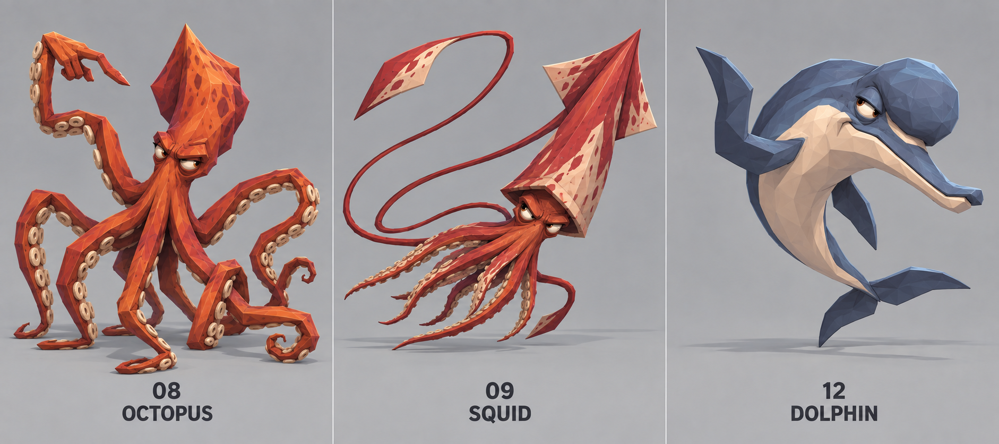

## Remaining marine animals · v7

This sheet applies the same less-cute, angular comic direction to the remaining species while excluding the reef shark and sea turtle: 01 parrotfish, 02 angelfish, 03 clownfish, 04 pufferfish, 06 manta ray, 08 octopus, 09 squid, 10 spiny lobster, 11 shore crab and 12 dolphin.

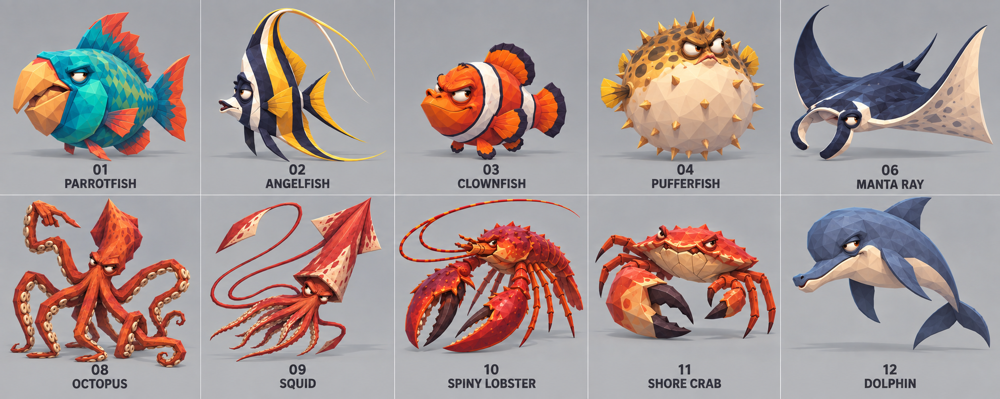

## Corrected fish, manta ray and dolphin study · v8

Focused revision of 01–03, 06 and 12 to carry the newer angular comic direction into the first fish and make the manta/dolphin silhouettes clearer. The standalone manta study below supersedes the manta shown on this combined sheet.

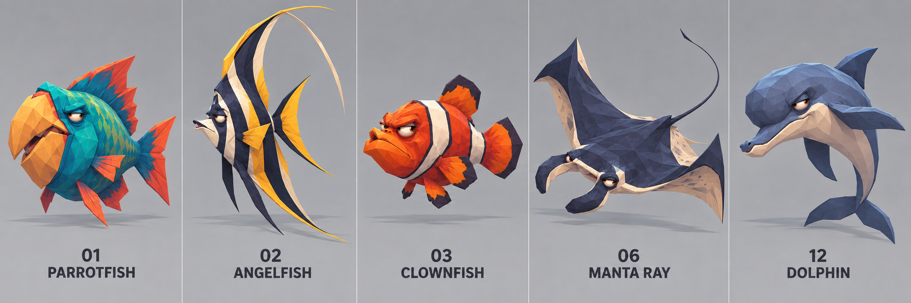

## Manta ray silhouette · v9

Standalone manta-ray study emphasizing the broad, flat pectoral disc and whip tail so the silhouette reads as a ray rather than a shark.

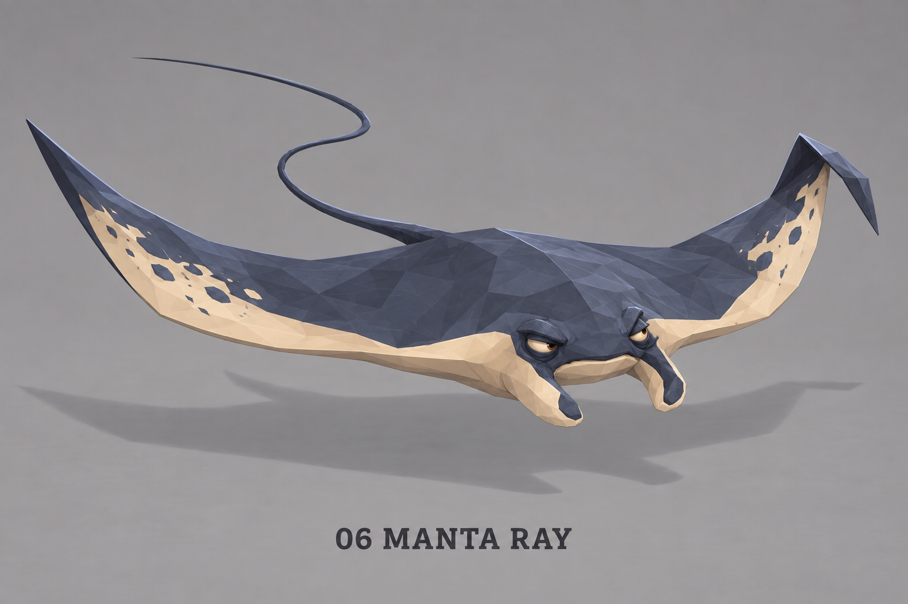

## Full marine animal sheet · v10

Unified labeled sheet for the ten retained species, excluding reef shark and sea turtle. It brings the latest angular comic direction together with the corrected broad-wing manta ray and revised fish silhouettes.

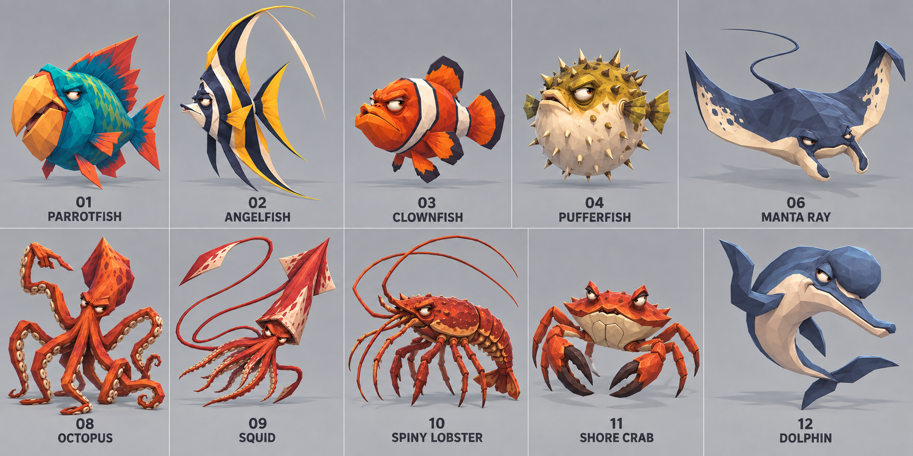

## Complete labeled lineup · v11

Final full-species lineup restores all twelve entries, including 05 reef shark and 07 sea turtle.

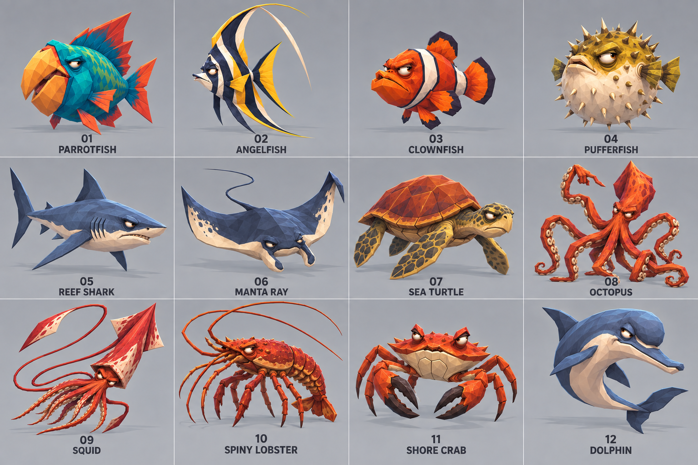
