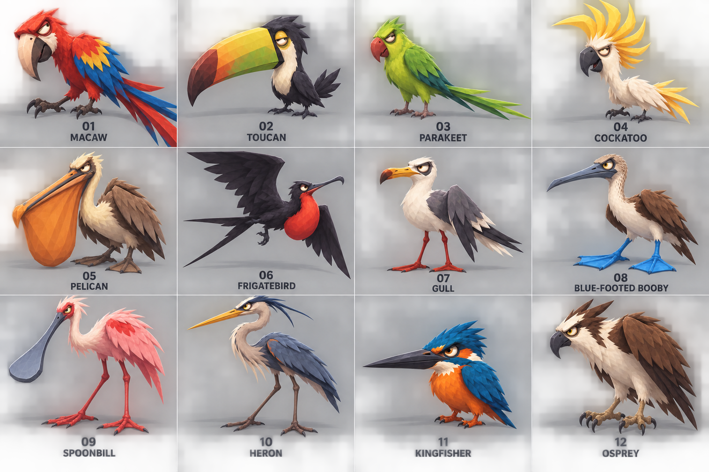

# Coastal birds · comic style revision v3

This sheet applies the same angular, awkward, less-cute comic direction used for the latest marine-animal studies. It keeps all twelve species from v1, numbered and named for review. These are concept references, not final 3D models, topology or rig specifications.

Species order: macaw, toucan, parakeet, cockatoo; pelican, frigatebird, gull, blue-footed booby; spoonbill, heron, kingfisher, osprey.

## Prompt

> Create a polished stylized 3D pirate-game bird character reference sheet with exactly 12 distinct tropical coastal bird species in a clean 4-column by 3-row grid, numbered and labeled. Use the attached latest angular, awkward, funny marine-creature designs as the exact style direction: broad faceted cel-shaded forms, dry comic character acting, lopsided poses, skeptical squints and awkward silhouettes, much less cute than common cartoon animals. Match the captain/grunt's bold readable toon style. Use attached older bird sheet only for the exact 12 species and their grid order, not for its cute rendering. Each bird full-body in a consistent three-quarter profile or readable side view, one per equal light grey cell with clear gutters, large number and exact uppercase name beneath. Species in order: 01 MACAW, 02 TOUCAN, 03 PARAKEET, 04 COCKATOO; 05 PELICAN, 06 FRIGATEBIRD, 07 GULL, 08 BLUE-FOOTED BOOBY; 09 SPOONBILL, 10 HERON, 11 KINGFISHER, 12 OSPREY. Exaggerate real bird anatomy in a funny and awkward way, but keep correct recognizable avian silhouettes. Macaw: compact hunched body, huge hooked beak, long crooked tail feathers, suspicious squint. Toucan: tiny angular body burdened by an absurdly oversized heavy bill, head tilting under its weight. Parakeet: narrow angular body with overlong uneven tail and tiny feet, hunched attitude. Cockatoo: jagged absurdly tall swept crest, skinny neck, awkward stiff posture. Pelican: hunched neck and enormous sagging angular throat pouch dragging close to ground. Frigatebird: dramatically wide angular wings, tiny body and exaggerated forked tail, awkward airborne banking. Gull: lanky thin legs, stout angular body, one wing drooping, unimpressed side-eye. Blue-footed booby: skinny legs and neck with comically overlarge webbed blue feet, clumsy stance. Spoonbill: very long angular legs and neck with an extremely wide flat spoon-shaped bill. Heron: towering spindly legs and sharp exaggerated S-shaped neck, stiff awkward balance. Kingfisher: squat compact body, enormous straight pointed bill and oversized angular head, intent squint. Osprey: broad angular folded wings and ruffled crown feathers, hunched stern posture, powerful hooked beak. Comedy should feel odd, dry, and gestural, not kawaii, plush, or sweet. Avoid huge sparkling eyes, round baby bodies, big friendly smiles, human faces, clothes or props. Broad clean color planes, restrained detail, cohesive tropical palette. No scene, no plants, no title, no extra text, exact legible number/species labels only, no logos/watermarks, no crops or overlapping cells.

## Review note

The species silhouettes are intentionally varied through beaks, crests, pouches, tails, legs and wing shapes; the artwork should be judged for style and silhouette before it is used as modeling guidance. Anatomy, scale, animation and in-game materials still need a 3D implementation and scene review.
