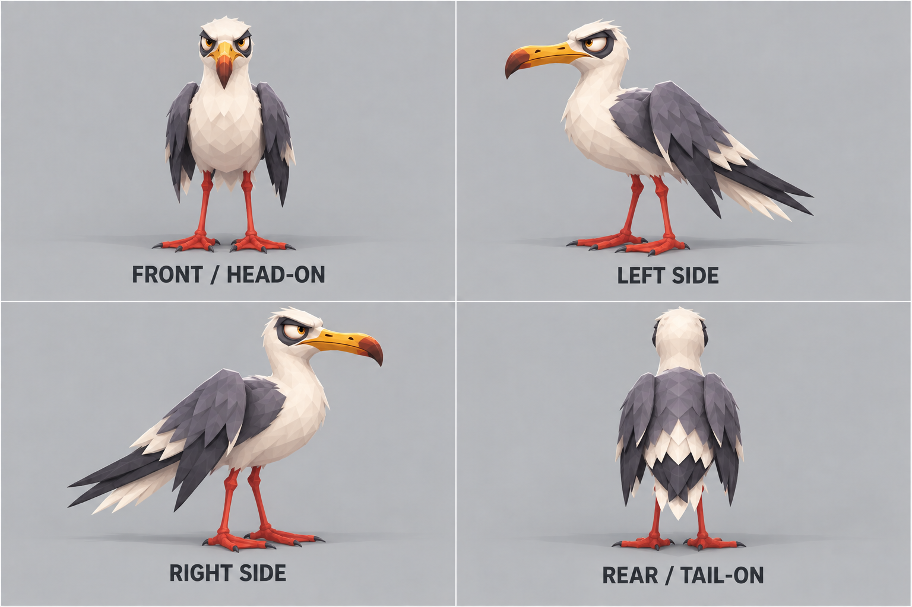

# Gull 07 · model turnaround v1

This turnaround follows the comic gull on the v3 coastal-bird sheet: angular grey folded wings, pale body and head, orange-yellow pointed bill, red-orange legs and feet, and a skeptical expression. The labels mean head-on beak view, exact left and right profiles, and rear/tail-on view. Use it as visual modeling guidance; generated images are not calibrated orthographic renders.

For wing rigging, use the additional spread pose: [gull-07-wing-spread-rigging-v1.png](gull-07-wing-spread-rigging-v1.png). It shows the bird head-on with the wings extended and feather groups visible; keep the turnaround above for body and folded-wing proportions.

The all-sides wing-spread turnaround is [gull-07-turnaround-wings-spread-v2.png](gull-07-turnaround-wings-spread-v2.png). Front and rear show the full span; the left and right orthographic profiles correctly foreshorten the extended wings edge-on.

## Prompt

> Create a professional orthographic 3D model turnaround sheet for the exact stylized GULL, species 07, from the attached coastal bird sheet. Select the bird labeled 07 GULL (white head and body, grey angular folded wings, slender red-orange legs and feet, yellow-orange pointed bill, skeptical heavy-lidded eye and one slightly drooping wing). Preserve its design, proportions, faceted cel-shaded pirate game art style, colors, and dry awkward personality consistently in all views. Show four exact orthographic views in a clean 2x2 grid: FRONT / HEAD-ON (looking directly at the beak, bilateral symmetry, both legs visible); LEFT SIDE (perfect 90-degree profile facing left); RIGHT SIDE (perfect 90-degree profile facing right, true opposite side, matching proportions); REAR / TAIL-ON (directly from behind looking along the body toward its head, show back, folded wings, tail and both legs). No three-quarter views. Bird stands naturally upright on both feet, wings folded in every view, same height and scale across panels, aligned baselines. Pale neutral grey background, subtle unobtrusive contact shadow, clear gutters and large exact labels beneath views. Accurately show beak profile/front, head shape, folded wing mass, tail feathers and legs in corresponding views. Bird anatomy must remain consistent and recognizable; don't invent different plumage markings, accessories or props. Broad clean low-poly facets and crisp cel shading, no black outlines, not photorealistic, not cute. No scenery, no text besides the four view labels, no logo, no watermark.
