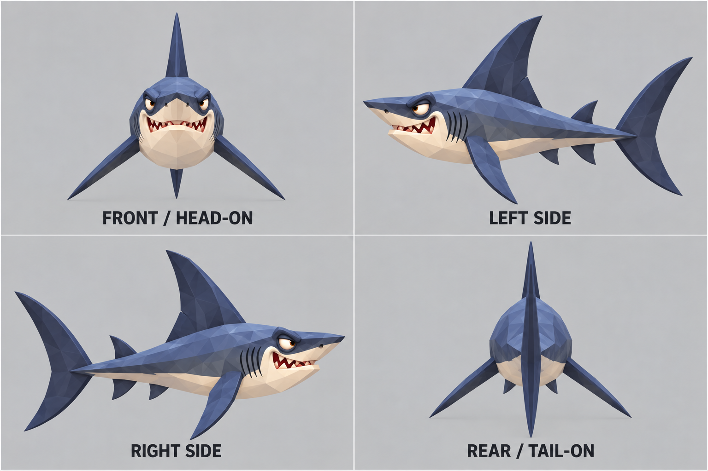

# Reef shark 05 · model turnaround v1

This sheet follows the user's selected reef shark image. View labels define the animal's orientation explicitly: **front/head-on** looks toward the snout, **left side** and **right side** are exact opposite profiles, and **rear/tail-on** looks along the body axis from behind. Intended as a visual guide for 3D modeling; generated concept art is not a calibrated orthographic render or a substitute for checking mesh proportions and hidden anatomy.

## Prompt

> Create a professional orthographic 3D model turntable reference sheet of the exact reef shark shown in the attached image. Preserve its distinctive design: angular faceted dark slate-blue upper body, pale cream underside and lower jaw, long pointed snout, narrow small eye, slightly crooked underbite with a few small uneven triangular teeth, five gill slits, tall triangular first dorsal fin, smaller second dorsal fin, paired pectoral fins, pelvic/anal fins and crescent vertical shark tail. Keep its silhouette, proportions and colors consistent across views. Layout four equal panels in a clean 2x2 grid on uniform neutral light gray, same orthographic scale, same neutral lighting, no perspective distortion, no shadows that obscure the outline, full creature fully visible in every panel. Exact views: FRONT (head-on, looking directly into the snout, bilateral symmetry, pectoral fins left/right); LEFT SIDE (perfect 90-degree profile, shark facing left); RIGHT SIDE (perfect 90-degree profile, shark facing right, consistent true opposite side with markings mirrored naturally); REAR (tail-on, looking directly from behind the shark along its body axis toward the head, bilateral symmetry). Each view must be a true orthographic projection, not three-quarter. Align body center and scale in all panels. Use clear large labels exactly: FRONT / HEAD-ON, LEFT SIDE, RIGHT SIDE, REAR / TAIL-ON. Style remains stylized cel-shaded low-poly game art, with crisp polygon facets, no outlines and minimal studio presentation. No scene, water, props, extra fish, text beyond those four labels, no title, no logos, no watermark. This is a model-reference turn sheet, not a new design. Accuracy of view angles and matching anatomy between views is more important than decorative polish.
