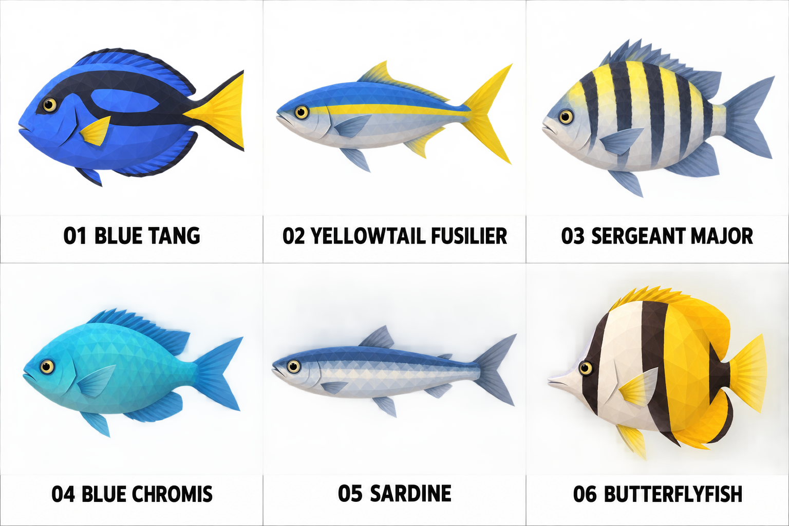

# Ambient schooling fish · v1

Six compact fish types for repeated background schools: blue tang, yellowtail fusilier, sergeant major, blue chromis, sardine and butterflyfish. They use simple body masses, a few broad color groups and clear tail/fin silhouettes so they remain readable at a distance and inexpensive to model and animate. The sheet is a concept reference, not a final topology or animation specification.

## Prompt

> Create a polished 3D game modeling reference sheet for six simple small fish species intended as ambient schools swimming around the ocean in a stylized pirate game. Match the project's cel-shaded low-poly environment and creature art: broad clean facets, bold readable silhouettes, restrained material detail, cohesive tropical colors. These are background school fish, not hero characters: keep geometry simple and efficient, modest small eyes, neutral animal expressions, no elaborate facial acting, no accessories. Show six distinct fish in a clean 3-column x 2-row grid, one full fish centered per pale near-white cell, all the same approximate body length and same exact side profile facing left, consistent scale and lighting, no perspective, no cropping, clear gaps, large legible number and exact uppercase species name beneath. Species: 01 BLUE TANG; 02 YELLOWTAIL FUSILIER; 03 SERGEANT MAJOR; 04 BLUE CHROMIS; 05 SARDINE; 06 BUTTERFLYFISH. Blue tang: compact oval body, small pointed mouth, blue body with simple dark marking and bright yellow tail. Yellowtail fusilier: slender torpedo-shaped blue-silver body, small fins and forked yellow tail. Sergeant major: deep oval damselfish with five simple dark vertical bars on pale yellow-silver body. Blue chromis: small streamlined oval, teal-blue body, tiny fins and forked tail. Sardine: slender silver-blue body, simple dark-blue back and silver side, forked tail. Butterflyfish: tall compressed disc body, short pointed snout, two broad simple color patches and small fins. Make each silhouette distinct but simple enough to repeat in large shoals. Use 3-5 broad color regions per fish, low-poly faceted planes, no visible scales or tiny spots. Correct fish anatomy, calm studio shadows, no water, scenery, props, title, extra words, logos, watermark, dark vignette or photorealism.
