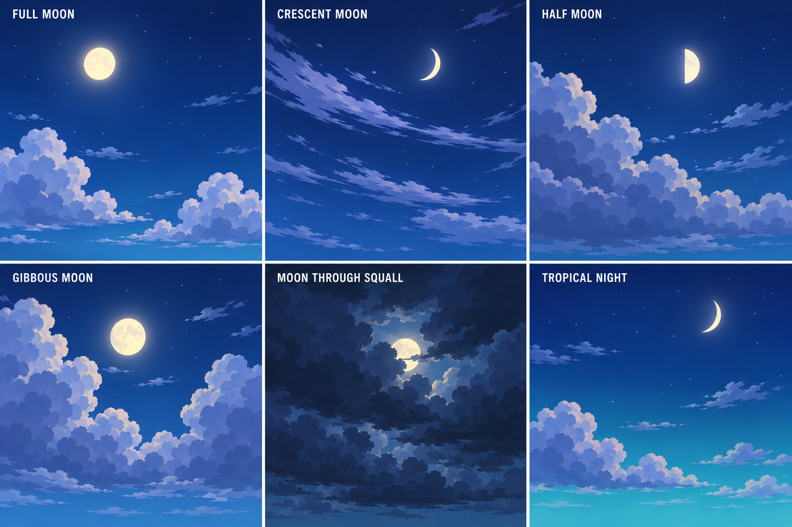

# Pirate-world night sky and moon · v1

Six nighttime studies in the same broad cel-shaded style as the project's tropical island skies: full moon, crescent moon, half moon, gibbous moon, moon through squall and tropical night. Cool blue-violet cloud facets and sparse stars keep the sky readable. These are visual development concepts, not implemented sky shaders or lighting presets.

## Prompt

> Create a polished visual-development reference sheet of night skies for the same stylized pirate game as the attached sky reference. Match its clean, broad, readable shapes and faceted cel-shaded cloud treatment, but shift to a calm nighttime palette: deep navy and indigo overhead, blue-teal near the horizon, cool moonlit blue-lavender cloud shadow planes, restrained pale silver light. Six distinct wide sky-only panels in a clean 3-column x 2-row grid, each with an easy-to-read exact short label. The moon must be clearly visible in each panel in different phases or cloud conditions; simple graphic celestial disk, not a realistic photograph, with a subtle halo only. Stars should be sparse, tiny and deliberate, not noisy. Clouds remain broad grouped stylized forms with clear silhouettes, not realistic vapor. No foreground terrain, ocean, buildings, ships, birds, UI, or framing decorations. Six variants: 1 FULL MOON — luminous round ivory moon, clear deep blue sky, sparse stars, low small cumulus; 2 CRESCENT MOON — thin crescent, drifting broad wispy clouds, rich indigo; 3 HALF MOON — clean half moon above layered blue cloud banks; 4 GIBBOUS MOON — nearly full moon partly framed by sculptural cloud masses; 5 MOON THROUGH SQUALL — cloud-darkened sky with large slate-blue storm shapes and moonlight breaking through a clear gap, dramatic yet readable; 6 TROPICAL NIGHT — cobalt-to-teal horizon gradient, warm-pale crescent moon, a few low rounded cloud clusters and sparse stars. Keep everything in the reference's stylized pirate-game art direction with flat readable values and restrained gradients. Labels exactly: FULL MOON, CRESCENT MOON, HALF MOON, GIBBOUS MOON, MOON THROUGH SQUALL, TROPICAL NIGHT. Professional concept sheet, no additional text, no watermark.
