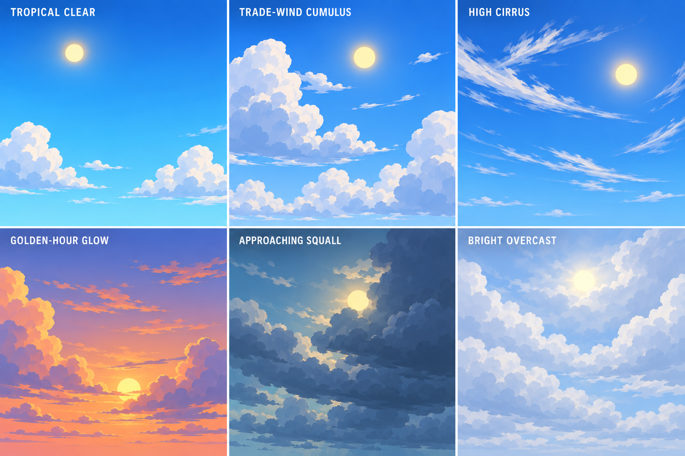

# Pirate-world sky and clouds · v1

Six sky studies following the project's island and beach references: saturated blue, a warm simple sun, and broad readable stylized clouds with cool shaded facets. Variations are tropical clear, trade-wind cumulus, high cirrus, golden-hour glow, approaching squall and bright overcast. These are visual development concepts, not implemented sky shaders or lighting presets.

## Prompt

> Create a polished art-direction reference sheet for sky backgrounds in the same stylized pirate game as the attached references. Use their bright tropical palette, clean readable shapes and faceted cel-shaded environment look: especially the beach/island sky with saturated clear blue, simple white chunky cumulus clouds with cool blue-grey shaded undersides, and distant hazy horizon. Show six distinct wide rectangular sky-only panels in a clean 3-column by 2-row grid, each with a clear readable short label. No foreground characters, terrain, ocean, buildings, birds, UI, or framing decorations; these are sky and cloud references. Include a visible stylized sun in every panel, sometimes clear, sometimes partly veiled by clouds. Sun should be a simple warm golden circular disc with restrained soft halo, no photorealistic glare, lens flare or detailed rays. Cloud shapes should be large, grouped, graphic and softly faceted with clean silhouettes and broad cool shadow planes, not noisy realistic vapor. Six variations: 1 TROPICAL CLEAR — rich cyan-to-blue gradient, bright small sun, only a few low puffy white cumulus; 2 TRADE-WIND CUMULUS — reference-style blue sky with several grouped sculptural white clouds and blue-grey undersides, warm sun high; 3 HIGH CIRRUS — deep clear blue, elegant sparse stylized streaks of high cloud, strong clean sun; 4 GOLDEN-HOUR GLOW — peach and coral horizon fading into violet-blue above, low warm sun partially framed by cloud bands; 5 APPROACHING SQUALL — muted blue-teal sky, broad layered slate-blue cloud mass, sun faintly breaking through a gap, dramatic but still family-friendly; 6 BRIGHT OVERCAST — pale blue sky, large layered soft white cloud groups, sun disk subtly diffused behind thin cloud. Keep all six cohesive in the same pirate-game art direction and use readable value separation. Labels exactly: TROPICAL CLEAR, TRADE-WIND CUMULUS, HIGH CIRRUS, GOLDEN-HOUR GLOW, APPROACHING SQUALL, BRIGHT OVERCAST. Professional visual development sheet, no extra text, no watermark.
